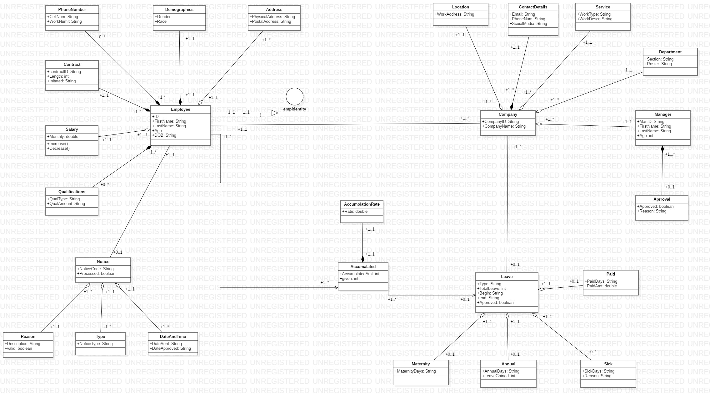

Domain
-	Employee leave system
Problem description
-	Mainly dealing with tracking leave taken and leave request between employees and company.
-	Employees will be able to use request functions for leave
-	System tracks employee accumulation of annual leave
-	Account and track allocation of sick leave
-	Keep records of each leave process 
-	Alert and give notifications of leave requests and/or availability 
-	Give permissions to certain functions depending on the user

This system will essentially have a more organized and easier process when issuing leave between the two parties.

